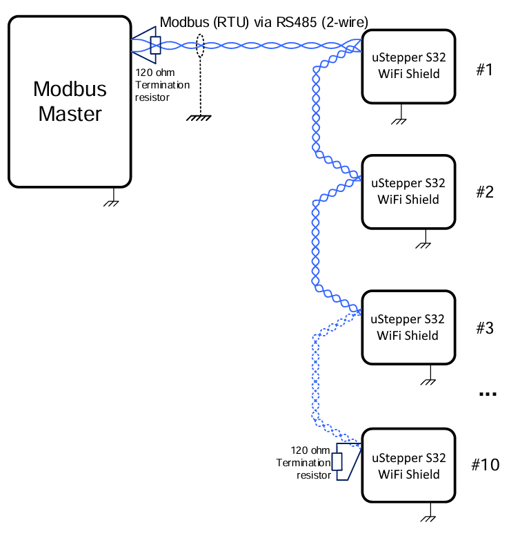

# uStepper S32 WiFi Shield 

This repository provides you with the three basic code snippets relevant for the uStepper S32 WiFi Shield:

1. **uStepper WiFi GUI** - providing you with an easy and intuitive way to control a single uStepper S32 manually while also providing the ability to record and replay sequences of operation
2. **UART bridge** - a simple piece of software that bridges the uStepper S32 Modbus interface to the RS485 physical interface on the uStepper S32 WiFi Shield
3. **ESPHome** - enabling you to expose the uStepper S32 Modbus interface in ESPHome compatile smart home systems which at the time of writing is Home Assistant and to some extent Homey

## Flashing the binaries
To get the functionality of either GUI, Modbus RTU or ESPHome interface we have provided the compiled binaries for you to upload using the Espressif Flash Download Tool:

https://docs.espressif.com/projects/esp-test-tools/en/latest/esp32/production_stage/tools/flash_download_tool.html

Simply connect the uStepper S32 WiFi Shield to you computer using the USB-C interface, open the tool, select ESP32-C3 as chip and press OK. You now see the picture where you must select the binary and ensure the right column says 0x0000. Select the appropriate COM port - if it is not available, find the boot and reset buttons on the uStepper S32 WiFi Shield, press and hold boot and shortly press reset before releasing boot again - now the board is forced into programming mode and should be visible as a COM port. Push start and wait until the programming is done.

## Building the code
If you for some reason wish not to use the compiled binaries and build the code yourself then that is og course also an option. To build the code for the uStepper S32 WiFi Shield GUI and UART Bridge, you must use the Ardunio IDE with library dependencies installed and support for ESP32C3 boards. For the ESPHome code a .yaml file is provided to be compiled in ESPHome.

## uStepper WiFi GUI
The uStepper S32 WiFi GUI is hosted on the WiFi shield and thus requires no application on your interface device - meaning that you can connect to the WiFi Shields Exposed Access Point, open a browser and enter 192.168.4.1 to get the interface exposed on any device.

## Modbus RTU Connection
Max 200 m cable length. 
Characteristic impedance 100 - 130 Ohm. 
Shunt capacitance < 100 pF/m. 

### Common ground: 
All network nodes must share a common ground connection as the bus signals shall refer to the same voltage potential. 

### Network termination: 
120 Ohm resistors shall be connected between the two RS485 signal wires at each end-point of the bus wire. The resistor value shall match the characteristic impedance of the cable.

## Modbus Protocol description
Details on the protocol can be found here:

[Modbus Documentation](./docs/ModbusUtilitiesDocumentation.md)

## ESPHome Modbus Interface
Loading the ESPHome binary on the uStepper S32 WiFi Shield and the Modbus example code on the uStepper S32 enables the integration of uStepper S32 in e.g., Home Assistant.

